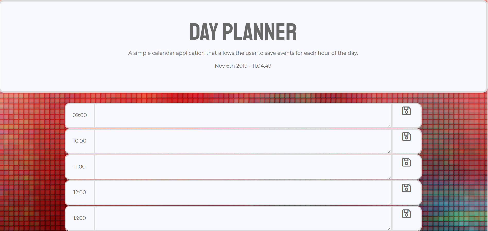

# Day-Planner

## Description
A simple calendar application that allows the user to save events for each hour of the day.

## Table of Contents
* [Installation](#installation)
* [Technologies-Libraries](#technologies-libraries)
* [Demo](#demo)
* [Credits](#credits)

## Installation
In your terminal type:
```git clone https://verlitas.github.io/Day-Planner/```
* Open in Visual Studio to build and run.
* For further instructions, visit https://help.github.com.

## Technologies-Libraries
CSS - HTML - JavaScript - Bootstrap

## Demo


Live link: https://verlitas.github.io/Day-Planner/

## Credits
[Melody Kirshberg](https://github.com/verlitas)  
[UABootCamp](https://bootcamp.ce.arizona.edu/coding/)  
[Background picture](https://www.reddit.com/r/MinimalWallpaper/comments/dj1plh/please_enjoy/)
